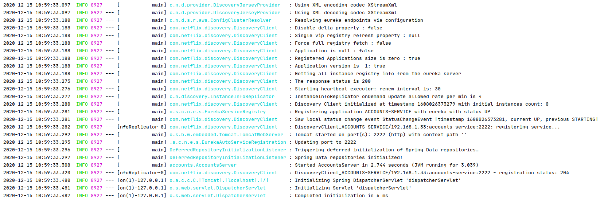
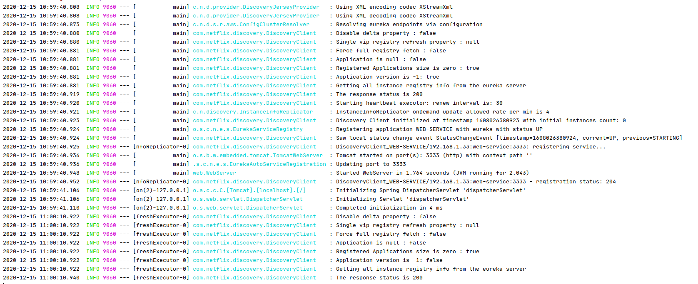
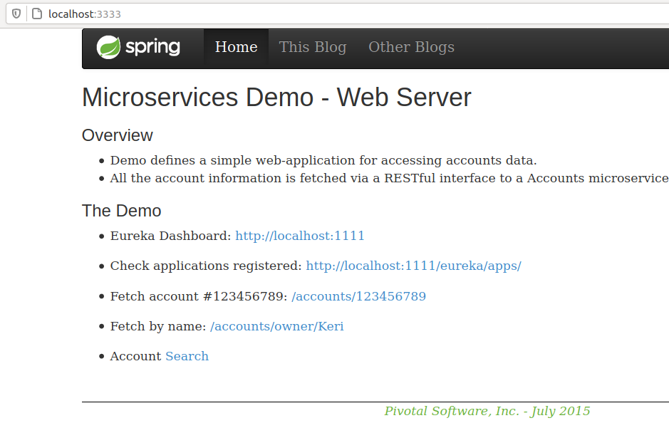
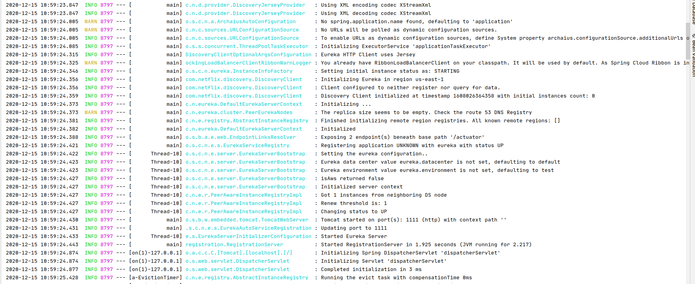
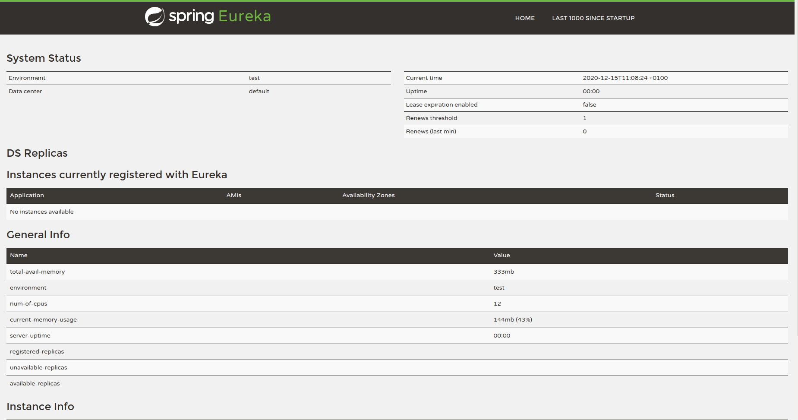
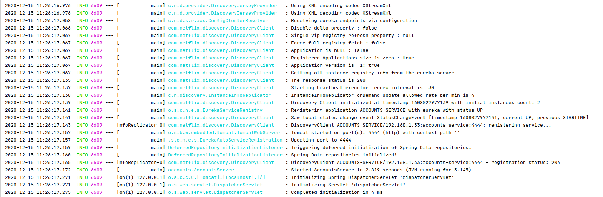
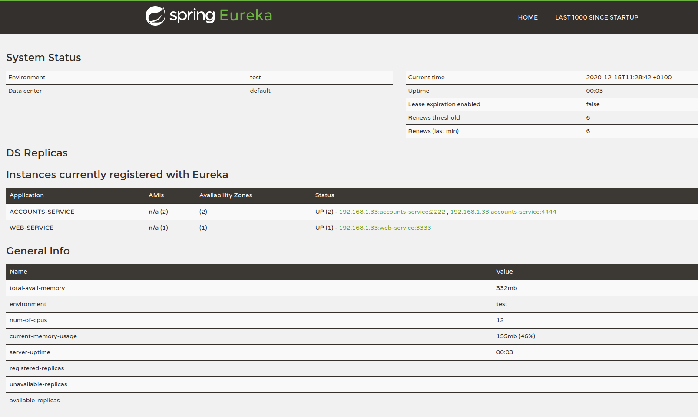
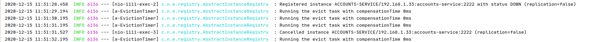
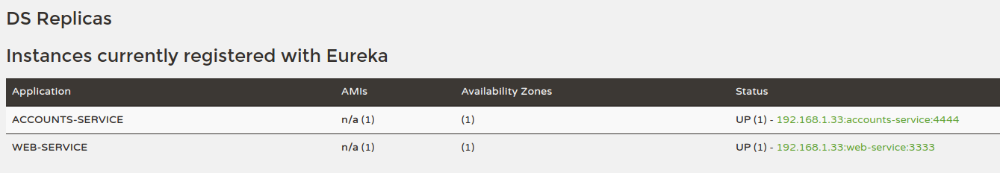

* **The objective is to show that the following activities have been accomplished:**

* **The two microservices accounts (2222) and web are running and registered (two terminals, logs screenshots)**
    
    Accounts on port 2222:
      
      
    Web on the terminal and the browser:
        
        
        
      

* **The service registration service has these two microservices registered (a third terminal, dashboard screenshots)**
    
    Registration launched:
      
      
    Registration dashboard:
      

* **A second accounts microservice instance has been started and will use the port 4444. This second accounts (4444) is also registered (a fourth terminal, log screenshots).**
    
    Accounts on port 4444:
      
      
    Dashboard with new accounts service:
      

* **What happens when you kill the microservice accounts (2222) and do requests to web? Can the web service provide information about the accounts again? Why?**
    
    Killing the microservice accounts on port 2222, as it's seen the instance of the service has been cancelled.
    
    
    Checking it does not appear on the dashboard:
    
    
   The microservice has been remove from the registration dashboard, however the web service still can provide information about the accounts due to there's a second
   accounts service registered. It's now using the microservice on port 4444 to provide the information.
   